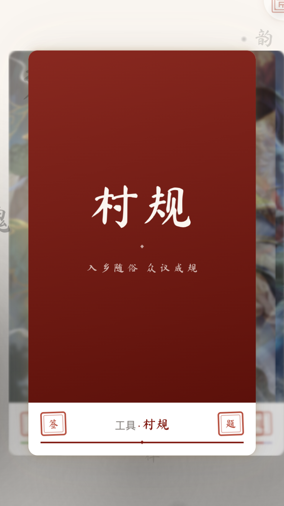
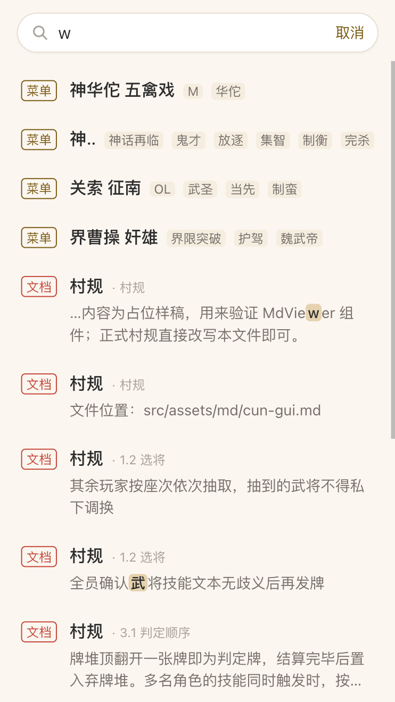
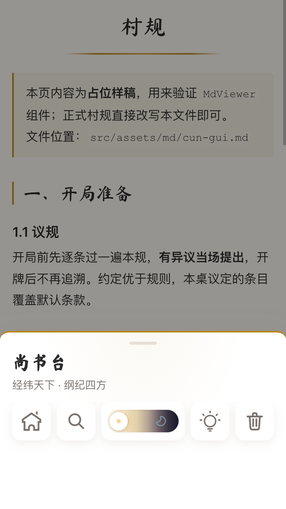
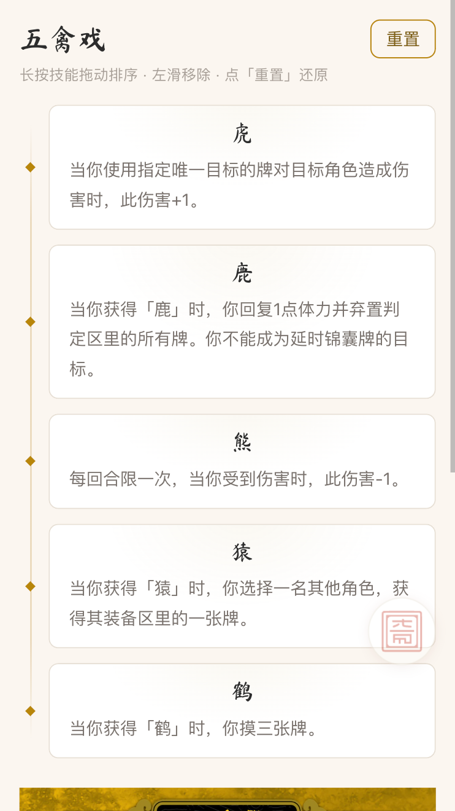
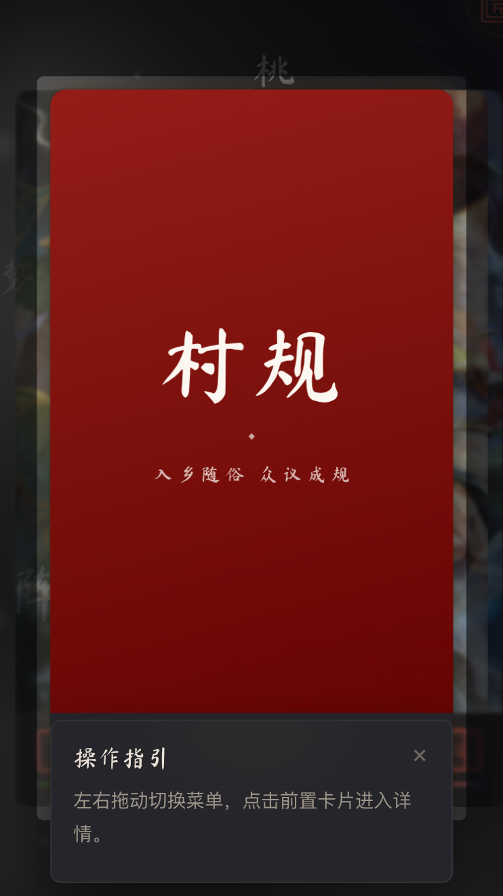
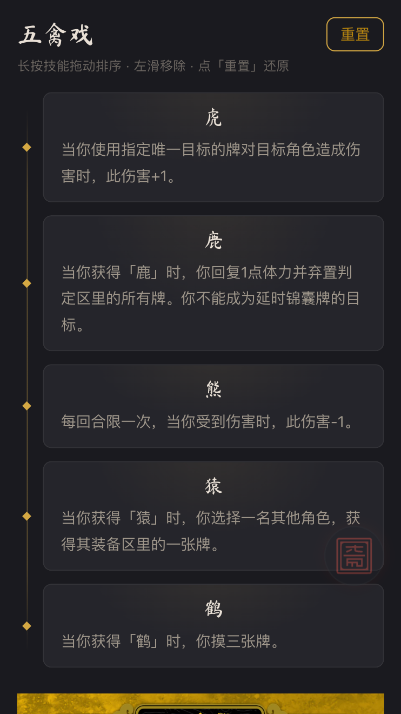

# 面杀辅助工具 · msgs-helper

> 受命于天，既寿永昌

面杀现场的手机速查工具 —— 武将技能、大旗立绘、村规结算，一屏翻到、一搜就中。

`Vue 3.5` · `Vite 6` · `Pinia 3` · `reka-ui` · 移动端优先（内容最大宽度 480px）· 当前版本 `1.0.2`

---

## 一、主要用途

**面杀**是三国杀的线下局。牌桌上真正麻烦的从来不是打牌，而是**临场查资料**：

- 某个武将的改版技能到底怎么结算？（神速、魂姿、极略、征南……一个武将一套说法）
- 这条村规是这么打的吗？上次谁说的算？
- 这张牌的牌面长什么样、技能原文怎么写？
- 桌上一圈人等着，手机里翻相册、翻群聊记录、翻半年前的截图——最慢的那种方式。

这个项目就是把这些「临场要查的东西」收进一个移动端 Web 应用，做成**一块随身的牌桌资料板**：

| 定位           | 说明                                                                            |
| -------------- | ------------------------------------------------------------------------------- |
| **纯前端**     | 无后端、无接口、无登录。构建产物是一堆静态文件，丢到任意静态服务器即可运行      |
| **离线可用**   | 所有图片、Markdown 正文随包发布（`import` / `?raw` 打进产物），断网照常看       |
| **开机即用**   | 启动画面之后直接是卡片堆叠的主页，不经过列表页，第一时间能翻到要找的那张牌      |
| **不碰服务端** | 页内操作（卡片顺序、主题、技能排序）只写在**本机 localStorage**，不联网、不上报 |
| **单手可操作** | 滑动切卡、单击搜索、长按控制台，全部围绕拇指可达范围设计                        |

---

## 二、技术栈

| 分类         | 选型                                        | 用在哪                                                  |
| ------------ | ------------------------------------------- | ------------------------------------------------------- |
| 框架         | **Vue 3.5**（`<script setup>` 组合式 API）  | 全部页面与组件                                          |
| 构建         | **Vite 6**                                  | 开发服务器（默认端口 `9456`）与打包                     |
| 路由         | **Vue Router 4**                            | 由菜单注册表 `menus.js` 动态生成路由                    |
| 状态管理     | **Pinia 3**                                 | 统一 localStorage 缓存 store（`useLocalStorage`）       |
| CSS 预处理   | **Less**                                    | 所有 `.vue` 的 `<style scoped lang="less">`             |
| 设计令牌     | 原生 **CSS 变量**                           | `design-tokens.css` 为单一事实源，禁止硬编码色值 / 间距 |
| 无头交互组件 | **reka-ui 2**                               | 抽屉 Drawer、搜索 Dialog、全局轻提示 Message、Tooltip   |
| 教学导览     | **driver.js**                               | 首次进入页面时的高亮引导                                |
| 检索         | **fuse.js** + **pinyin-pro** + **mark.js**  | 模糊匹配 / 汉字转全拼与首字母 / 落地页滚动高亮          |
| Markdown     | **marked**                                  | 村规、结算细则等文档正文渲染                            |
| 图标         | 自制 **SVG**（`?raw` 内联）                 | 朱砂印章、搜索、日月、清空等                            |
| 代码规范     | **ESLint 9**（flat config）+ **Prettier 3** | `npm run lint` / `npm run format`                       |
| 测试         | **Vitest 1** + happy-dom + @vue/test-utils  | `npm test`                                              |
| 运行环境     | **Node ≥ 22**                               | 见 `package.json` 的 `engines`                          |

---

## 三、功能

### 1. 主页 · 卡片堆叠

- 全部工具以**扇形堆叠卡片**呈现：前置卡片凸显、背景卡片弱化（缩放 + 模糊 + 压暗），左右各展开 5 张
- 手势切换走「**累积门限**」模型：每滑满一段距离切一张，手速越快步长越小（最快 18px 一张），短促轻划（< 180ms）只切一张，碰壁不推进、反向立刻响应
- **最近访问自动置顶**：打开过的工具会插到队首，顺序持久化在本机
- 卡片封面两种形态：位图封面（武将立绘，可指定焦点与裁切方式）或**文字封面**（毛笔主标题 + 副标题，底色取该条目的主题色）
- 墨洇动态背景 + 页面切换淡入，视觉上是一整张宣纸

### 2. 玉玺悬浮按钮 · 全局手势入口

- 屏幕角落一枚可拖拽的朱砂印章：**单击 = 搜索，长按 = 控制台**，两个动作都不需要「等一等再决定」
- 静置 5 秒自动弱化，触碰即激活；带触觉反馈（不支持振动的环境用视觉震动兜底）
- 位置可拖动吸附并在视口变化时自动归位；主页有隐藏态（只露一角，避免挡住卡片堆叠）

### 3. 全局搜索

- 索引同时收录**菜单**（`menus.js`，含分类与自定义别名标签）与**文档正文**（`src/assets/md/` 下全部 `.md`，逐行切段）
- **三路检索**：汉字、全拼、拼音首字母。输入 `wqx`、`wuqinxi`、`五禽戏` 都能命中
- 输入即出结果（本地索引，无网络请求）；菜单结果是卡片入口，文档结果带所属章节与命中片段高亮
- 选中文档结果会**跳到对应菜单页、滚动到那一行并高亮关键字**（mark.js），不用自己在长文里找
- 拼音库与 Fuse 体积可观，**首次打开搜索时才动态载入**，不进首屏包

### 4. 尚书台控制台

- 玉玺长按唤起的底部抽屉，题「尚书台 · 经纬天下 纲纪四方」
- 6 列正方形网格，条目按 `colSpan` / `rowSpan` 占位，单位方格边长由 ResizeObserver 实时计算
- 收录 5 个控件：**返回主页 / 全局搜索 / 主题切换 / 教学导览 / 清除本页数据**
- 长按控件显示用途提示（Tooltip）；加控件只需往注册表 `consoleItems.js` 追加一条并写组件，布局代码不动

### 5. 武将技能页

- 技能用统一的 `SkillCard` 展示：毛笔技能名居中，可选标签加粗前置，下面接规则正文
- **神华佗 五禽戏**页是完整的手势列表：长按 360ms 拖动排序、左滑移除（滑过 72px，或距离过半且够快）、一键重置还原
- 技能文案是单一事实源（写在页面里），本机只存「顺序 + 存留」的 id 数组 —— 改文案立即生效，重置就是回到定义顺序

### 6. 图册与文档页

- **图片一律等比铺满容器宽度**：永不裁切、永不拉伸、加载前后不跳版，加载失败原地留占位
- 多图由页面自己组织（立绘在上、牌面在下），每张图可自带说明区域（纯文本或 Markdown 渲染）
- **文档走 Markdown 渲染**：标题用毛笔字体、列表记号与引用线走古铜金，图片同样铺满宽度
- 正文既支持「随包发布」（`?raw` 静态导入，离线可用、改文件即热更），也支持给地址自行 fetch

### 7. 教学导览

- 基于 driver.js，步骤注册在 `tourSteps.js`（单一事实源），换肤走 `tour-theme.css`
- 调度规则收敛在 `usePageTour` 一处，页面不用自己判冲突：
  - **玉玺教程优先** —— 菜单页首访让位给「单击搜索 / 长按控制台」的教学
  - **同屏只有一个教程** —— 已有教程在跑就跳过，不抢也不排队
  - **页面教学从第二次进入本页起** —— 避免刚点开就被糊一脸
  - 三条让位路径都**不消耗教学次数**，下次进入自动补上

### 8. 明暗主题与国风设计系统

- 一键切换浅色（宣纸暖白）/ 深色（暗夜谋局），在 Vue 挂载前写入 `data-theme`，无闪白
- 设计语言扎根三国物质文化：**宣纸**底色、**松烟墨**文字、**朱砂**强调、**古铜金**主色、**竹简**纵条、**漆器**光泽
- 完整规范见 [`DESIGN_SYSTEM.md`](DESIGN_SYSTEM.md)（令牌、组件规范、反模式）与 [`ANIMATION_SPECS.md`](ANIMATION_SPECS.md)（动效精确参数）

### 9. 本机数据与版本

- 统一缓存 store 管理 localStorage：**系统 / 控件**用固定 key，**页面**用 `route.fullPath` 动态 key
- 控制台「清除本页数据」= 删缓存 + 删内存缓存 + 页面重挂载回默认值（一步到位，不留残留态）
- 启动时比对 `package.json` 的版本号，不一致就清空本机数据，避免旧数据结构污染新版本

### 10. 移动端适配

- 内容最大宽度 480px，桌面端居中呈现；页面自建滚动容器，配 `overscroll-behavior: contain` 不出橡皮筋
- 适配刘海屏与底部指示条安全区（`--safe-area-*`）
- 禁用浏览器内置的缩放、双击放大、回弹与长按菜单，手势全部收归应用自己处理

---

## 四、界面截图

> 图片统一放在 `docs/screenshots/`，与下表文件名一一对应。
> 当前这一套均为手机竖屏 `742 × 1320`（约 `371 × 660` 的 2x 导出），`.png` 格式；新增截图请保持同样比例与尺寸。

| 文件                           | 内容                                                              |
| ------------------------------ | ----------------------------------------------------------------- |
| `docs/screenshots/home.png`    | 主页卡片堆叠（浅色主题，前排是一张有立绘的武将卡）                |
| `docs/screenshots/search.png`  | 全局搜索蒙层（输入 `shen` 或 `五禽`，列表里有菜单与文档两类结果） |
| `docs/screenshots/console.png` | 尚书台控制台抽屉展开（背景为主页）                                |
| `docs/screenshots/skills.png`  | 武将技能页（神华佗 五禽戏：技能列表 + 大旗）                      |
| `docs/screenshots/tour.png`    | 主页教学导览（首次进入主页时，卡片堆叠上的「操作指引」高亮气泡）  |
| `docs/screenshots/dark.png`    | 深色主题（村规文档页或图文资料页）                                |

### 主页 · 卡片堆叠



### 全局搜索



### 尚书台控制台



### 武将技能页



### 教学导览 · 主页



### 深色主题



> 截图清单、命名与拍摄规格见 [`docs/screenshots/README.md`](docs/screenshots/README.md)。

---

## 五、快速开始

```bash
# 安装依赖（Node ≥ 22）
npm install

# 开发：默认 http://localhost:9456，已开放局域网访问，手机可直连调试
npm run dev

# 打包 / 预览
npm run build
npm run preview

# 质量检查
npm run lint      # ESLint
npm run format    # Prettier
npm test          # Vitest 单元测试
```

多环境配置走 `.env` / `.env.dev` / `.env.uat` / `.env.prod`，构建脚本见 `build.sh`。

---

## 六、目录结构

```
msgs-helper/
├── index.html                  # 入口：冷启动背景色防白闪
├── vite.config.js              # 别名 @ → src/、~ → 根目录；dev 端口 9456
├── DESIGN_SYSTEM.md            # 设计系统（令牌、组件规范、反模式）
├── ANIMATION_SPECS.md          # 动效规范（精确参数）
├── CLAUDE.md                   # 面向协作 / Agent 的项目约定
├── docs/
│   ├── screenshots/            # README 用截图
│   ├── research/               # 调研与布局设计
│   └── superpowers/            # 设计文档与实施计划
└── src/
    ├── App.vue                 # 布局分发 + 启动画面 + 页面过渡 + 全局控件
    ├── assets/
    │   ├── css/                # design-tokens.css（令牌单一事实源）、tour-theme.css
    │   ├── icons/              # 自制 SVG 图标
    │   ├── images/             # 菜单封面 / 大旗 / 牌面
    │   └── md/                 # 页内展示的 Markdown 正文（搜索索引自动收录）
    ├── components/             # 业务组件：Console 控制台 / GlobalSearch 搜索 /
    │                           # JadeSeal 玉玺 / InkWashBackground 墨洇背景 / GlobalControls
    ├── ui/                     # 无业务耦合基础组件：Drawer / ImageFigure / MdViewer /
    │                           # Message / SkillCard / SplashScreen / Tooltip
    ├── layout/                 # BackgroundLayout（墨洇背景）/ BlankLayout（纯 slot）
    ├── composables/            # useAppShell / useConsole / useGlobalSearch / useTour /
    │                           # usePageTour / usePageReady / useKeywordHighlight 等
    ├── constants/              # 单一事实源：menus 菜单 / consoleItems 控制台 /
    │                           # storageKeys 缓存 key / tourKeys + tourSteps 导览
    ├── pages/                  # 页面：home 主页 + 各武将 / 工具页
    ├── router/                 # 路由：由 menus.js 动态生成
    ├── stores/                 # Pinia：统一 localStorage 缓存
    └── utils/                  # markdown 切段 / pinyin 转换 / search 封装 / random
```

---

## 七、约定与规范

- **新增一个工具 / 菜单**：图片放进 `src/assets/images/menus/` → 往 `src/constants/menus.js` 追加条目（含 `tags` 检索标签与 `docs` 文档归属）→ 写页面（页面**必须**调用 `usePageReady()`，否则启动画面永不解除）
- **单一事实源**：菜单、控制台条目、缓存 key、导览 key 全部集中在 `src/constants/`，别处不写字符串字面量
- **样式**：颜色 / 字体 / 间距一律走 `var(--token)`，禁止硬编码；动效参数照 `ANIMATION_SPECS.md`
- **版本号**：改动涉及持久化数据（store 字段、localStorage key、菜单注册表）时，同一次提交内升级 patch 版本
