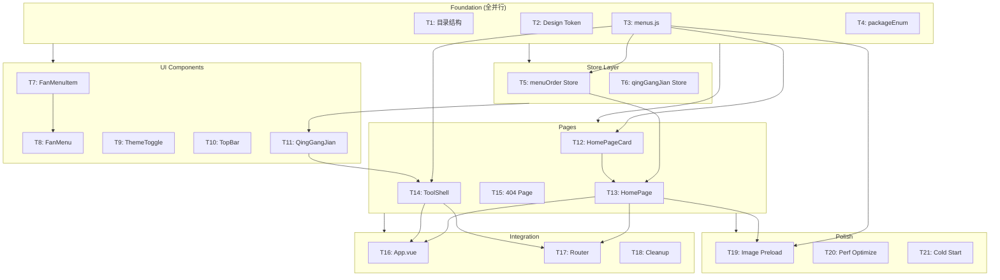

# v2 Layout Redesign — 可执行任务清单

**版本**：v1 | **日期**：2026-06-19 | **对应设计**：`2026-06-19-v2-layout-redesign-design.md`

---

## 任务依赖图（Mermaid）



---

## 预估工作量

| 组 | 任务数 | 预估总行数 | 预估工时 |
|----|:------:|:----------:|:--------:|
| Foundation | 4 | ~140 | 0.5h |
| Store Layer | 2 | ~160 | 1h |
| UI Components | 5 | ~640 | 2.5h |
| Pages | 4 | ~650 | 2h |
| Integration | 3 | ~80 (+ 删除) | 0.5h |
| Polish | 3 | ~90 | 0.5h |
| **合计** | **21** | **~1760** | **~7h** |

---

## 全局设计约束（所有任务必须遵守）

1. **颜色**：所有颜色通过 `var(--token)` 引用，禁止硬编码 hex/rgb
2. **动画**：仅使用 `transform` + `opacity`（Composite-Only），遵守 `prefers-reduced-motion`
3. **触摸目标**：交互元素最小 44×44px（WCAG 2.5.5）
4. **设计 Token**：单一事实源 `src/assets/css/design-tokens.css`
5. **动画 Token**：使用 `var(--ease-enter)` / `var(--ease-ink)` / `var(--ease-out)` 等，禁止硬编码 cubic-bezier
6. **样式组织**：`<style scoped>` + Less 嵌套语法（less 已安装）
7. **图片路径**：统一从 `src/assets/images/menus/` 引用，支持 GIF/PNG/JPG/WebP

---

## Foundation — 目录结构与基础设施

### Task 1: 创建 v2 目录结构
**文件**：目录创建（无单一文件）
**依赖**：无
**描述**：创建 v2 布局所需的新目录：`composables/`、`constants/`、`pages/tools/`，以及 stores 下的 Pinia store 文件占位。确保 `.gitkeep` 不被误删。
**验收标准**：
- [ ] `src/composables/` 目录存在
- [ ] `src/constants/` 目录存在
- [ ] `src/pages/tools/` 目录存在
- [ ] `src/stores/` 目录已存在（无需创建）
**难度**：🟢 简单
**预估行数**：0（仅 `mkdir`）

---

### Task 2: 新增 Design Token
**文件**：`src/assets/css/design-tokens.css`（追加 ~35 行）
**依赖**：无
**描述**：在现有 design-tokens.css 中追加 v2 布局需要的 5 个新 Token。`--ink-wash-overlay` 用于墨洇遮罩（与 `--bg-overlay` modal 纯黑遮罩区分），其余为布局尺寸 Token。
**要追加的 Token**：
```css
/* v2 Layout Tokens */
--sword-blade-length: 180px;    /* 剑身长度 */
--sword-blade-height: 28px;     /* 剑身高度 */
--card-offset-x: 70px;          /* 卡片水平偏移量 */
--card-visible-count: 6;        /* 可见卡片数量 */
--ink-wash-overlay: rgba(44, 44, 44, 0.75); /* 墨洇暖黑遮罩 */
```
**验收标准**：
- [ ] 5 个新 Token 追加到 `design-tokens.css` 末尾（保持现有 519 行不变）
- [ ] `[data-theme="dark"]` 下 `--ink-wash-overlay` 有对应暗色值（`rgba(0, 0, 0, 0.85)`）
- [ ] 所有 Token 带中文注释
- [ ] 不影响已有 Token 的引用
**难度**：🟡 中等
**预估行数**：~35 行（含注释和 dark 变体）

---

### Task 3: 创建 menus.js 工具注册表
**文件**：`src/menus.js`（新建 ~80 行）
**依赖**：无
**描述**：创建单一事实源 `menus[]` 注册表，定义所有工具菜单的元数据。每个条目包含 name、route、image（src/focalX/focalY/fit）、themeColor、packageName、orientation。初期图片使用占位色块，后续替换为实际图片路径。
**注册表结构**：
```js
export const menus = [
  {
    name: '体力卡',
    route: '/tool/ti-li-ka',
    image: {
      src: '',  // 先占位，后续替换
      focalX: 50,
      focalY: 50,
      fit: 'cover',
    },
    themeColor: '#c44536',
    packageName: '基础',
    orientation: 'vertical',
  },
  // ... 其余菜单项
]
```
**验收标准**：
- [ ] `menus[]` 导出为具名 exports（`export const menus`）
- [ ] 包含至少 10 个菜单条目（覆盖现有 23 张图片中的代表性条目）
- [ ] 每个条目包含全部 5 个字段组（name/route/image/themeColor/packageName/orientation）
- [ ] `route` 字段为 `/tool/:name` 格式
- [ ] `orientation` 为 `'vertical'` 或 `'horizontal'`
- [ ] 图片 `src` 初期为空字符串或占位色块标记（不阻塞开发）
**难度**：🟡 中等
**预估行数**：~80 行

---

### Task 4: 创建 packageEnum.js 包名常量
**文件**：`src/constants/packageEnum.js`（新建 ~8 行）
**依赖**：无
**描述**：创建包名枚举常量模块，供 menus.js 和 HomePageCard.vue 引用。提供结构化包名定义，便于诏书标签展示和后续扩展。
**验收标准**：
- [ ] `PackageName` 对象导出，包含 `BASIC`、`WARLORD`、`ASSIST` 三个初始枚举值
- [ ] 值为中文字符串（`'基础'`、`'武将'`、`'辅助'`）
- [ ] 模块为纯 JS 常量（非 Pinia Store）
**难度**：🟢 简单
**预估行数**：~8 行

---

## Store Layer — 状态管理

### Task 5: 创建 menuOrder Store（LRU 排序）
**文件**：`src/stores/menuOrder.js`（新建 ~60 行）
**依赖**：Task 3（menus.js 注册表）
**描述**：创建 Pinia Store 管理菜单排序。首次加载按 `menus[]` 注册表定义顺序排列；之后每次访问工具时将该工具移到数组首位（LRU 策略）。排序状态持久化到 localStorage，包含版本号和 migration 逻辑。
**核心逻辑**：
```js
// 首次：按 menus[] 顺序
// 之后：recordAccess(name) → 该工具移到首位
// 持久化：localStorage key = 'msgs-menu-order-v1'
```
**验收标准**：
- [ ] `orderedMenus` getter 返回排序后的菜单列表
- [ ] `recordAccess(name)` action 将指定菜单移到首位
- [ ] 首次加载时排序与 `menus[]` 定义顺序一致
- [ ] 排序状态持久化到 localStorage（key 包含版本号 `v1`）
- [ ] 有 version key 校验逻辑（`STORAGE_VERSION_KEY`），版本不匹配时清空重置
- [ ] 不影响 `menus[]` 原始注册表（只维护排序引用）
**难度**：🟡 中等
**预估行数**：~60 行

---

### Task 6: 创建 qingGangJian Store（剑状态）
**文件**：`src/stores/qingGangJian.js`（新建 ~100 行）
**依赖**：无（纯状态管理，不依赖其他 task）
**描述**：创建 Pinia Store 管理青釭剑的运行时状态：吸附边（left/right）、展开/收起（isExpanded）、当前显示文本（currentText）、拖拽位置。展开状态持久化到 localStorage。
**验收标准**：
- [ ] `side` 状态：`'left' | 'right'`，默认 `'right'`
- [ ] `isExpanded` 状态：默认 `true`（首次展开）
- [ ] `currentText` 状态：默认空字符串，可由外部设置
- [ ] `toggleExpand()` action 切换展开/收起
- [ ] `setSide(side)` action 设置吸附边
- [ ] `isExpanded` 持久化到 localStorage（key 含版本号 `v1`）
- [ ] 有 version key 校验逻辑，版本不匹配时重置为默认值
**难度**：🟡 中等
**预估行数**：~100 行

---

## UI Components — 可复用组件

### Task 7: 创建 FanMenuItem.vue
**文件**：`src/components/ui/FanMenuItem.vue`（新建 ~50 行）
**依赖**：无
**描述**：扇形菜单的单个菜单项。接收 icon、label 两个 props，emit `@select` 事件。支持 `--accent-gold` 描边和 hover 高亮。最小触摸目标 44px。
**Props**：
```js
defineProps({
  icon: String,   // 图标 SVG 文件名或 emoji
  label: String,  // 中文标签文字
})
defineEmits(['select'])
```
**验收标准**：
- [ ] 渲染图标 + 标签文字
- [ ] 点击/触摸时 emit `select` 事件
- [ ] 触摸目标 >= 44×44px
- [ ] hover 态使用 `var(--accent-gold-bg)` 背景
- [ ] 所有颜色通过 `var(--token)` 引用
- [ ] `prefers-reduced-motion` 时禁用过渡动画
**难度**：🟡 中等
**预估行数**：~50 行

---

### Task 8: 创建 FanMenu.vue
**文件**：`src/components/ui/FanMenu.vue`（新建 ~150 行）
**依赖**：Task 7（FanMenuItem.vue）
**描述**：扇形菜单容器，以剑首为中心点，以圆弧排列 3 个 FanMenuItem。打开时从圆心向外 45° 扇形展开，收起时缩回。菜单项为：语音（展开/收起剑身）、搜索（后续开发）、设置。
**交互**：
- 短按剑首 → 打开菜单（顺时针展开动画）
- 点击菜单外区域 → 关闭菜单
- 点击菜单项 → emit `@select` 并关闭菜单
**验收标准**：
- [ ] 打开/关闭使用 `transform: scale()` + `opacity` 动画，`var(--ease-enter)` 200ms
- [ ] 菜单定位：相对于 trigger 元素（通过 slot 或 prop 传入 anchor）
- [ ] 3 个菜单项以圆弧排列（使用 `transform: rotate()` + `translate()` 计算位置）
- [ ] 点击菜单外背景区域关闭菜单
- [ ] `v-if` 控制挂载/卸载，配合 `<Transition>`
- [ ] `prefers-reduced-motion` 时菜单直接出现/消失（无动画）
- [ ] 通过 Teleport 或 fixed 定位避免被父容器 overflow 裁剪
**难度**：🟡 中等
**预估行数**：~150 行

---

### Task 9: 创建 ThemeToggle.vue
**文件**：`src/components/ui/ThemeToggle.vue`（新建 ~40 行）
**依赖**：无
**描述**：主题切换按钮。点击在 `<html data-theme>` 的 `light` / `dark` 之间切换。图标使用日/月 SVG 或 emoji。状态从 `data-theme` 属性读取，无需额外 store。
**验收标准**：
- [ ] 读取 `document.documentElement.dataset.theme` 判断当前主题
- [ ] 点击切换 `data-theme` 属性（`light` ↔ `dark`）
- [ ] 图标在日/月之间切换（SVG 或 emoji）
- [ ] 触摸目标 >= 44×44px
- [ ] 主题偏好可选持久化到 localStorage
**难度**：🟢 简单
**预估行数**：~40 行

---

### Task 10: 创建 TopBar.vue
**文件**：`src/components/ui/TopBar.vue`（新建 ~50 行）
**依赖**：无
**描述**：工具页顶部栏（可选组件）。显示当前工具名称（从 route params 读取），左侧可选返回按钮，右侧放置 ThemeToggle。通过 slot 支持自定义内容。
**验收标准**：
- [ ] 显示当前工具名称（从 `useRoute().params.name` 读取）
- [ ] 左侧默认 slot 放置返回按钮（可选，由 ToolShell 传入）
- [ ] 右侧 slot 放置 ThemeToggle
- [ ] 高度固定（~48px），使用 `var(--bg-surface)` 背景
- [ ] 底部使用 `var(--border)` 分隔线
- [ ] 所有颜色通过 `var(--token)` 引用
**难度**：🟢 简单
**预估行数**：~50 行

---

### Task 11: 创建 QingGangJian.vue（青釭剑悬浮组件）
**文件**：`src/components/ui/QingGangJian.vue`（新建 ~350 行）
**依赖**：Task 6（qingGangJian Store）、Task 8（FanMenu.vue）
**描述**：核心悬浮控件，横置古剑形态。剑首（56px 圆形）为交互入口，支持短按（打开 FanMenu）、长按（回主页 `/`）、拖拽（剑柄吸附左/右边缘）。剑身显示台词或工具名称，支持展开/收起动画。剑身可滑动收起。
**关键交互实现**：
```
pointerdown → 判断手势类型：
  - 移动 > 10px  → 拖拽模式（剑跟随手指，松手时吸附边缘）
  - 500ms 不动 → 长按 → router.push('/')
  - < 300ms 抬起 → 短按 → 打开 FanMenu
```
- 拖拽时 `touch-action: none` 防止页面滚动
- 吸附规则：剑柄 X < 50% → 左边，≥ 50% → 右边
- 剑身收起动画：`transform: scaleX(0)`，origin 在剑柄侧
**CSS 结构**（视觉部位）：
| 部位 | Token | 尺寸 |
|------|-------|------|
| 剑首 | `--bg-surface` + `--accent-gold` 描边 | 56×56px |
| 剑格 | `--accent-gold-light` | 装饰短线 |
| 剑身 | `--bg-surface` 半透明底 | 180×28px |
| 剑尖 | `--accent-gold-light` | 三角形 |
**验收标准**：
- [ ] 剑首 56×56px 圆形，`--bg-surface` 底色 + `--accent-gold` 描边 + 穗绳装饰（CSS 实现）
- [ ] 短按剑首 → FanMenu 出现在剑首周围（通过 FanMenu 组件）
- [ ] 长按剑首（≥500ms）→ `router.push('/')`
- [ ] 拖拽剑首 → 剑整体跟随手指移动，松手后吸附到最近边缘（`var(--ease-enter)` 300ms）
- [ ] 剑柄始终贴边，剑身横置，剑尖朝向屏幕内侧
- [ ] 剑身显示 `store.currentText` 文字，从右向左滚动（`overflow: hidden` + `translateX` animation）
- [ ] 剑身收起动画：`transform: scaleX(0)`，origin 剑柄侧，使用 `var(--ease-ink)`
- [ ] 剑在主页（`/`）不显示，仅 `ToolShell.vue` 内部显示
- [ ] `touch-action: none` 在剑首上防止拖拽时页面滚动
- [ ] 展开/收起状态通过 qingGangJian Store 管理，持久化到 localStorage
- [ ] 所有动画仅 `transform` + `opacity`
- [ ] `prefers-reduced-motion` 时禁用所有过渡动画
- [ ] `position: fixed`，z-index 高于工具内容但低于 modal/overlay
**难度**：🔴 复杂
**预估行数**：~350 行（最大的单文件）

---

## Pages — 页面层

### Task 12: 创建 HomePageCard.vue
**文件**：`src/pages/HomePageCard.vue`（新建 ~120 行）
**依赖**：Task 3（menus.js 注册表）
**描述**：主页卡片堆叠中的单张卡片。展示菜单图片 + 诏书标签（谕/旨印章 + 包名 + 分隔符 + 标题 + 底部装饰线）。支持 `focalX`/`focalY` 裁剪、主题色动态覆盖。图片未加载时展示占位色块 + 菜单名称。
**Props**：
```js
defineProps({
  menu: Object,  // menus[] 中的单个条目
  isFront: Boolean,  // 是否为最前层（用于高亮辉光）
})
defineEmits(['click'])
```
**诏书标签结构**：
```
┌──────────────────────────┐
│   [图片 / 占位色块]       │  object-position: focalX focalY
├──────────────────────────┤
│  谕  基础 · 标题  旨    │  印章 + 包名 + 分隔符 + 标题 + 印章
│      ═══════════════     │  底部金色装饰线（.decorative-line--knotted）
└──────────────────────────┘
```
**验收标准**：
- [ ] 尺寸：宽 = `calc(100vw - var(--space-8) * 2)`，宽高比 3:2
- [ ] 图片加载前展示占位色块 + 菜单名称（与 Splash Screen 视觉一致）
- [ ] 图片加载后使用 `object-fit: cover` + `object-position: ${focalX}% ${focalY}%`
- [ ] 诏书标签始终可见：左端"谕" + 包名 · 标题 + 右端"旨"，使用 `.seal-stamp` 朱砂红
- [ ] 底部装饰线使用 `.decorative-line--knotted`，颜色可被 `themeColor` 覆盖
- [ ] `isFront` 时应用 `var(--shadow-glow-gold)` 辉光
- [ ] 卡片背景使用 `var(--bg-surface)`，不受 themeColor 影响
- [ ] 所有颜色通过 `var(--token)` 引用（themeColor 动态变量通过 inline style 注入）
- [ ] 点击卡片 emit `@click` 事件
**难度**：🟡 中等
**预估行数**：~120 行

---

### Task 13: 创建 HomePage.vue
**文件**：`src/pages/HomePage.vue`（新建 ~300 行，替换现有 Home.vue）
**依赖**：Task 3（menus.js）、Task 5（menuOrder Store）、Task 12（HomePageCard.vue）
**描述**：主页 = 卡片堆叠，工具切换唯一入口 `route: '/'`。6 张等大卡片水平偏移堆叠，前层完整可见，后层依次向右偏移露出右侧边缘。左右滑动手势切换卡片，超过 25% 宽度阈值时吸附到下一张。
**背景**：墨洇效果 —— `::before` 使用 `backdrop-filter: blur(12px) brightness(0.6)` + `radial-gradient` + `--ink-wash-overlay`。卡片区域 `isolation: isolate` 隔断模糊继承。
**交互逻辑**：
```
touchstart → 记录起始 X
touchmove  → 计算 deltaX，移动所有卡片
touchend   → |deltaX| > 卡片宽度 × 25% → 吸附下一张
             |deltaX| ≤ 25% → 回弹原位
滑到边界 → 线性弹回（非循环）
方向不一致时 → 卡片先 rotate(90°) 250ms → 再 scaleUp 200ms → 路由导航
```
**验收标准**：
- [ ] 6 张等大卡片水平偏移堆叠，前层完整可见
- [ ] 每层向右偏移 `var(--card-offset-x)`（70px）
- [ ] z-index 递减（前层最高）
- [ ] 滑动超过 25% 宽度时吸附切换，未达阈值时弹回原位
- [ ] 滑到边界时线性弹回（不循环）
- [ ] 卡片切换使用简化交叉淡入淡出（非 FLIP 动画），`var(--ease-enter)` 300ms
- [ ] 选中卡片后：判断 `orientation` vs 设备方向，不一致时先 rotate(90°) 250ms，再 scaleUp 200ms → 路由导航到 `/tool/:name`
- [ ] 墨洇背景：`.texture-rice-paper` 纹理 + `::before` 模糊遮罩 + `--ink-wash-overlay`
- [ ] 卡片区域 `isolation: isolate` 隔断模糊
- [ ] 青釭剑在主页**不显示**
- [ ] 0 工具空状态不做特殊处理（开发者自用场景）
- [ ] 所有动画仅 `transform` + `opacity`，`prefers-reduced-motion` 时禁用
**难度**：🔴 复杂
**预估行数**：~300 行

---

### Task 14: 创建 ToolShell.vue
**文件**：`src/pages/ToolShell.vue`（新建 ~180 行）
**依赖**：Task 3（menus.js）、Task 11（QingGangJian.vue）
**描述**：工具页外壳，包裹 `route: '/tool/:name'` 下的所有工具组件。提供墨洇背景（与主页一致）、青釭剑悬浮（固定在右下角）、工具内容区（`flex: 1`，组件自主布局）。通过 `<RouterView>` 或动态组件渲染子工具。
**布局**：
```
┌──────────────────────────────┐
│  [工具内容]                   │  flex: 1
│                              │
│                         ┌──┐ │
│                         │剑│ │  青釭剑，position: fixed
│                         └──┘ │  默认右下角
└──────────────────────────────┘
```
**验收标准**：
- [ ] 背景墨洇效果与 HomePage.vue 一致（复用相同 CSS 或 mixin）
- [ ] 工具内容区占据全屏（100vw × 100vh），`flex: 1`
- [ ] 青釭剑悬浮在右下角（默认位置），`position: fixed`
- [ ] 青釭剑在此页面可见（非隐藏）
- [ ] 路由 `useRoute().params.name` 传递给子组件（通过 slot/provide/动态组件）
- [ ] 不需要 TopBar（剑的长按返回已替代返回按钮，各工具可自行决定是否加 TopBar）
- [ ] 长按剑首 → `router.push('/')` 回主页
- [ ] 所有颜色通过 `var(--token)` 引用
**难度**：🔴 复杂
**预估行数**：~180 行

---

### Task 15: 创建 404 页面
**文件**：`src/pages/NotFound.vue`（新建 ~50 行）
**依赖**：无
**描述**：国风 404 页面，当访问 `/tool/:name` 中不存在的工具或任何未匹配路由时显示。视觉风格与设计主题一致（墨韵金章）。
**验收标准**：
- [ ] 路由 `/:pathMatch(.*)*` 匹配所有未定义路由
- [ ] 显示国风装饰性"未寻得"文案
- [ ] 提供"返回主页"按钮/链接，跳转到 `/`
- [ ] 使用 `var(--font-display)`（Ma Shan Zheng 书法体）+ `var(--accent-gold)`
- [ ] 所有颜色通过 `var(--token)` 引用
**难度**：🟢 简单
**预估行数**：~50 行

---

## Integration — 路由与入口整合

### Task 16: 改造 App.vue（Transition + data-theme）
**文件**：`src/App.vue`（修改 ~30 行）
**依赖**：Task 13（HomePage.vue）、Task 14（ToolShell.vue）
**描述**：改造 App.vue 为带路由 Transition 的布局根节点。添加 `<router-view v-slot>` + `<Transition>` 实现页面切换动画。设置默认 `data-theme`。注入全局 `menus` 供所有页面使用。
**验收标准**：
- [ ] `<router-view v-slot="{ Component, route }">` 包裹 `<Transition>`
- [ ] Transition name 为 `page-fade`，enter: opacity + translateY(8px→0) 300ms `var(--ease-enter)`；leave: opacity(1→0) 200ms `var(--ease-enter)`
- [ ] `<script setup>` 中设置 `document.documentElement.dataset.theme = 'light'`（默认浅色）
- [ ] 通过 `provide('menus', menus)` 向下注入 menus 注册表
- [ ] 保留现有的 `<style>`（如有）或移除空 `<style>` 块
**难度**：🟡 中等
**预估行数**：~30 行（修改）

---

### Task 17: 重构路由配置
**文件**：`src/pages/index.js`（重写 ~40 行）、`src/router/routes.js`（无需修改）、`src/router/index.js`（微调）
**依赖**：Task 13（HomePage.vue）、Task 14（ToolShell.vue）、Task 15（NotFound.vue）
**描述**：重构路由表以支持 v2 布局：
- `/` → HomePage.vue（主页卡片堆叠）
- `/tool/:name` → ToolShell.vue（工具外壳）
- `/demo` → Demo.vue（保留）
- `/icon` → IconPreview.vue（保留）
- `/:pathMatch(.*)*` → NotFound.vue（404 兜底）
**验收标准**：
- [ ] `pages/index.js` 重写为新的路由数组
- [ ] `/` 路由指向 `HomePage.vue`（替换旧的 `Home.vue`）
- [ ] `/tool/:name` 路由指向 `ToolShell.vue`，meta 中标记为工具页
- [ ] `/demo` 和 `/icon` 路由保留不变
- [ ] 添加 `/:pathMatch(.*)*` → NotFound.vue 兜底路由
- [ ] 所有路由使用 `() => import(...)` 懒加载
- [ ] 不影响 `router/index.js` 的 scrollBehavior 和 beforeEach 守卫
**难度**：🟡 中等
**预估行数**：~40 行（重写）

---

### Task 18: 废弃清理
**文件**：无（仅删除操作）
**依赖**：Task 13（HomePage.vue 替换 Home.vue）、Task 17（路由重构完毕）
**描述**：删除不再使用的文件和代码。验证无残留引用。
**待清理项**：
| 目标 | 类型 | 原因 |
|------|------|------|
| `src/pages/Home.vue` | 删除 | 被 HomePage.vue 取代 |
| `src/store/` 旧 store（如有）| 检查 | 确保无旧 store 残留 |
| 双击返回逻辑（如有）| 删除 | 已从设计移除 |
**验收标准**：
- [ ] `src/pages/Home.vue` 已删除
- [ ] `npm run build` 无 import 报错
- [ ] 无未使用的 import（ESLint 检查通过）
- [ ] 不影响 `/demo` 和 `/icon` 路由
**难度**：🟢 简单
**预估行数**：-30 行（净删除）

---

## Polish — 性能与体验打磨

### Task 19: 创建 useImagePreload.js composable
**文件**：`src/composables/useImagePreload.js`（新建 ~60 行）
**依赖**：Task 3（menus.js 图片路径）、Task 13（HomePage.vue 集成点）
**描述**：图片预加载 composable。接收图片 URL 数组，通过 `new Image()` 或 `<link rel="preload">` 后台预加载。渲染当前可见 6 张 + 预加载后续 8 张。返回每张图片的加载状态（loading/loaded/error）。
**核心逻辑**：
```js
export function useImagePreload(urls) {
  // 返回 { loadState: Map<url, 'loading'|'loaded'|'error'>, preloadNext(n) }
  // 使用 new Image() 预加载，不阻塞渲染
}
```
**验收标准**：
- [ ] 接收 `urls: string[]` 参数
- [ ] 返回 `loadState` reactive Map（loading/loaded/error）
- [ ] `preloadNext(count)` 方法预加载队列中的后续 N 张
- [ ] 使用 `new Image()` 后台加载，不阻塞渲染
- [ ] 图片加载失败时标记 `error` 状态（非静默失败）
- [ ] 对空字符串 URL 跳过预加载
**难度**：🟡 中等
**预估行数**：~60 行

---

### Task 20: 性能优化（will-change / contain / 大图优化）
**文件**：分散在多个 `.vue` 文件中（~20 行增量）
**依赖**：Task 13（HomePage.vue）、Task 14（ToolShell.vue）、Task 11（QingGangJian.vue）
**描述**：对动画元素添加 `will-change` 提示、`contain` 隔离、大尺寸图片的 `loading="lazy"` 和 `decoding="async"`。确保 Composite-Only 动画路径无 layout/paint 触发。
**验收标准**：
- [ ] 滑动卡片容器添加 `will-change: transform`（动画结束后移除或设为 auto）
- [ ] 卡片堆叠容器添加 `contain: layout style` 隔离重排
- [ ] 剑身滚动添加 `will-change: transform` + `contain: strict`
- [ ] 所有 `` 标签添加 `loading="lazy"` + `decoding="async"`
- [ ] Chrome DevTools Performance 面板确认动画帧无 layout/paint（仅 Composite）
- [ ] `npm run build` 无性能相关 warning
**难度**：🟢 简单
**预估行数**：~20 行（散落修改）

---

### Task 21: 冷启动白屏防护
**文件**：`index.html`（修改 ~5 行）、可能的 `main.js` 微调
**依赖**：Task 13（HomePage.vue 作为首页）
**描述**：在 HTML 中预置 `background-color: var(--bg)` 的 inline style，防止 Vue 应用挂载前出现白屏闪烁。这是 Eng Review 中 unresolved decision 的落实项。
**验收标准**：
- [ ] `index.html` 的 `<body>` 或 `<div id="app">` 添加 inline `style="background-color: #faf6f0"`（light mode 默认值）
- [ ] 或在 `<style>` 块中为 `#app` 设置 fallback background
- [ ] Vue 挂载前页面显示为宣纸暖白背景（非纯白 #fff）
- [ ] 不影响 `data-theme="dark"` 时的背景色（由 CSS 变量接管）
**难度**：🟡 中等
**预估行数**：~5 行

---

## 实现建议

### 推荐执行顺序

```
Day 1（Foundation + Store，~1.5h）
  T1 → T2, T3, T4（并行）
  T3 → T5
  T6（独立并行）

Day 2（UI Components，~2.5h）
  T7 → T8
  T9, T10, T11（与 T7-8 并行）

Day 3（Pages + Integration，~2.5h）
  T3 → T12 → T13
  T11, T3 → T14
  T15（独立并行）
  T13, T14 → T16, T17（并行） → T18

Day 4（Polish，~0.5h）
  T19, T20, T21（并行）
```

### 并行执行提示

1. **Foundation 全并行**：T1-T4 没有任何依赖关系，可同时开工
2. **Store 全并行**：T5 和 T6 彼此独立，无共享状态
3. **UI Components 部分并行**：T7-T8 有依赖（串行），T9/T10 独立（可并行），T11 依赖 T6+T8
4. **Pages 部分并行**：T12→T13 串行，T14 与 T13 可部分重叠（T12 完成后即可开始 T13 和 T14），T15 完全独立
5. **Integration 部分并行**：T16 和 T17 都依赖 T13/T14，完成后可并行执行
6. **Polish 全并行**：T19-T21 互不依赖

### 验证策略

每个任务完成后，通过以下方式独立验证：
- **Foundation**：文件存在 + import 测试
- **Store**：在浏览器 console 中通过 `useXxxStore()` 调用验证状态和行为
- **UI Components**：在 Demo.vue 中临时挂载单个组件进行交互测试
- **Pages**：路由访问 + 手动交互测试（滑动、点击、长按）
- **Integration**：`npm run build` 无报错 + 全路由 smoke test
- **Polish**：DevTools Performance 面板 + Lighthouse 评分对比
